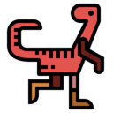
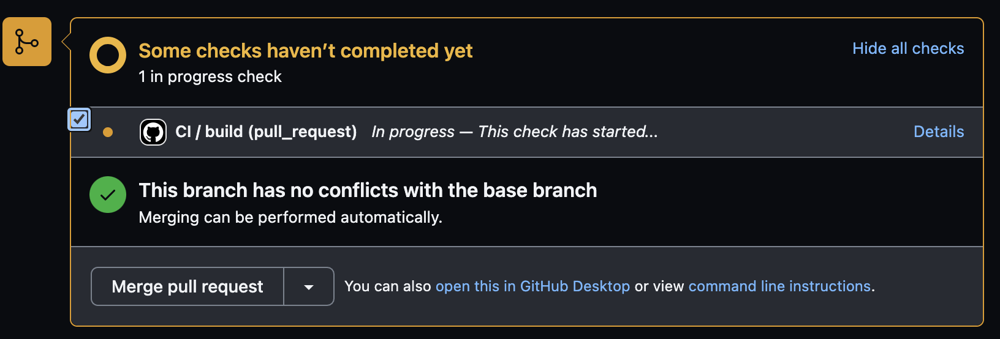
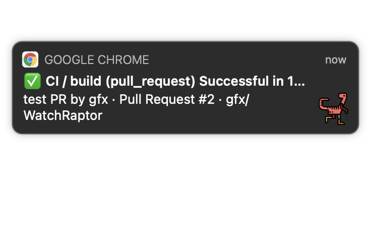

# WatchRaptor [](https://github.com/gfx/WatchRaptor/actions/workflows/ci.yml)

<div style="text-align: center"></div>

WatchRaptor is a Chrome extension to watch GitHub CI statuses.

## Features



↓



## Install it via Chrome Web Store

Not yet.

## Development

### Setup

```shell
npm ci
```

### Build

```shell
# build for development
npm run build

# build for development (watch mode)
npm run build:watch

# release build
npm run build:release
```

### Install it to Chrome for development

1. Open `chrome://extensions/`.
2. Turns on "Developer mode".
3. Click "Load unpacked" and then select the "dist/" dir in the repository.

## License

Copyright 2020 FUJI Goro.

Permission to use, copy, modify, and/or distribute this software for any purpose with or without fee is hereby granted, provided that the above copyright notice and this permission notice appear in all copies.

THE SOFTWARE IS PROVIDED "AS IS" AND THE AUTHOR DISCLAIMS ALL WARRANTIES WITH REGARD TO THIS SOFTWARE INCLUDING ALL IMPLIED WARRANTIES OF MERCHANTABILITY AND FITNESS. IN NO EVENT SHALL THE AUTHOR BE LIABLE FOR ANY SPECIAL, DIRECT, INDIRECT, OR CONSEQUENTIAL DAMAGES OR ANY DAMAGES WHATSOEVER RESULTING FROM LOSS OF USE, DATA OR PROFITS, WHETHER IN AN ACTION OF CONTRACT, NEGLIGENCE OR OTHER TORTIOUS ACTION, ARISING OUT OF OR IN CONNECTION WITH THE USE OR PERFORMANCE OF THIS SOFTWARE.
